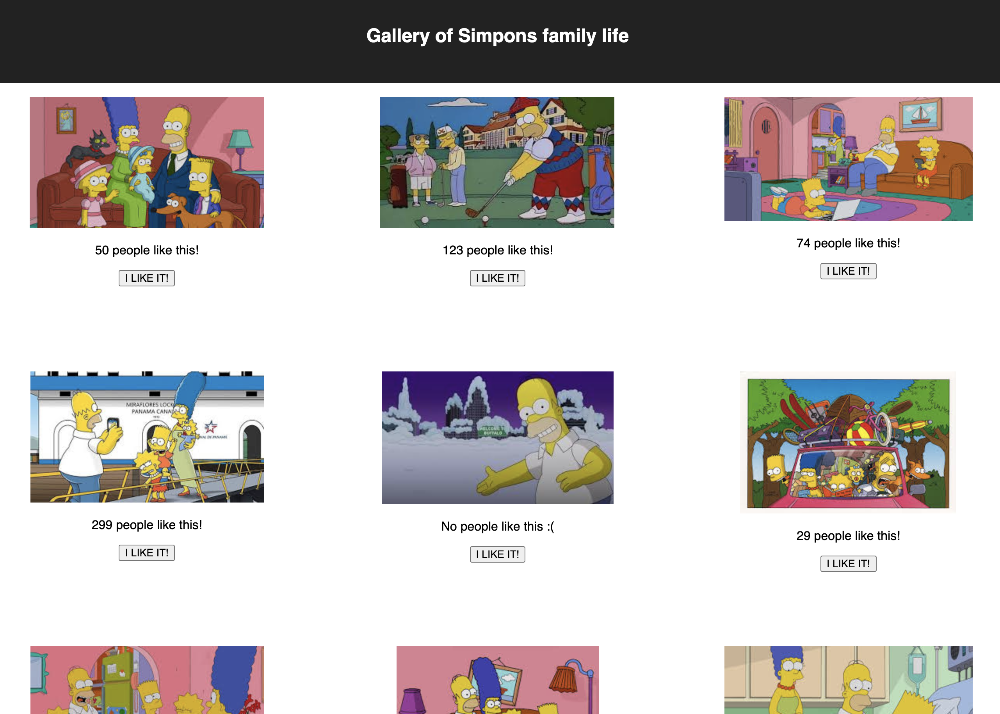

# Gallery of Simpons family life

## Screen Shots


## Description

This simple application allows the user to view some of photos that represents life of Simpson's family. You may also click on the photos to view a short description of each.  If you feel like leaving feedback a "like" button is also available to show your support!

## Built With

React, HTML5, CSS, Node, Express, Javascript,  Postman was/is also used for testing purposes. 

## Setup

There is no database component to base mode. All data is stored in an array on the server. 

Running the server code requires `nodemon`. If you don't already have `nodemon`, install it globally with `npm install nodemon --global`.

```
npm install
npm run server
```

Now that the server is running, open a new terminal tab with `cmd + t` and start the react client app.

```
npm run client
```


